## Prerequisities needed
* JDK 17
* Apache Maven 3.9.9
* Setup the GitHub account
* Install Git Bash
* IntelliJ IDE 2023.1.2
    <details><summary><b>Show instructions</b></summary>

  1. To install latest version of IntelliJ. Go to the official IntelliJ IDEA download page [See here] (https://www.jetbrains.com/idea/download/)
 
  2. Choose the **Community edition**
  </details>
* Docker Desktop - 27.3.1
  <details><summary><b>Show instructions</b></summary>
    
  1. Download Docker Desktop [See here] (https://www.docker.com/products/docker-desktop)
 
  2. After downloading run the **.exe** installer
  3. Once the installation is finished. Docker Desktop will start automatically. If it doesn't, you can manually start it by searching for Docker Desktop in the Start menu and running it.
  </details>
* Create Docker Hub credentials to access Docker images and repositories  
* Need docker-compose file for creating mysql container named **library**
  > **Note**
  > Saved in Project path : [docker-compose.yml](myapp/docker/mysqlContainer/docker-compose.yml)
  ##### Run the docker-compose command to startup the mysql container
  ```
  docker-compose up -d
  ```
* kubectl client v1.32.0
  <details><summary><b>Show instructions</b></summary>
    
  1. To install kubectl on Window using Git Bash
     ```
     curl -LO https://storage.googleapis.com/kubernetes-release/release/v1.10.0/bin/windows/amd64/kubectl.exe
     ```
  2. Run the kubectl version to verify
     ```
     kubectl version
     ```
  </details>
* Minikube - v1.35.0
  <details><summary><b>Show instructions</b></summary>
    
  1. Download Minikube Installer from [See here] (https://github.com/kubernetes/minikube/releases)
  2. Run the **.exe** installer by following the installer prompts
  3. Add Minikube to the PATH. The installer should automatically add Minikube to your system PATH. If not, manually add the path to the folder where Minikube is installed (e.g., C:\Program Files\Kubernetes\Minikube).
  4. Test that minikube works:
      ```
      minikube version
      ```
  </details>


### Spring Boot CRUD Application
---
To create a simple Spring Boot CRUD (Create, Read, Update, Delete) application involves several steps:
* Create Spring Boot project using **Spring Initializer** (https://start.spring.io/)
* Add dependencies
  - Spring Web (for RESTful APIs)
  - Spring Data JPA (for ORM and database interaction)
  - H2 Database (for an embedded database)
  - MySQL Database (as an external database)
  - Spring Boot DevTools (for live reloading during development)
  - Lombok (to avoid boilerplate code)
  - Spring Security (for HTTP Basic Authentication)
  - Spring Validation (for bean validation)
  - Jackson-databind library (to handle the automatic conversion between Java objects to and from JSON)
  - MapStruct library (to reduce the amount of manual mapping code in your application)
  - Spring Actuator (provides essential endpoints to expose application metrics, health, and management data)
  - Prometheus (collect, store, and analyze these metrics, enabling proactive monitoring and alerting)
* Define Entity model
  - **Customer** entity that has an embedded **Phonenumber** entity
    <p align="center">
      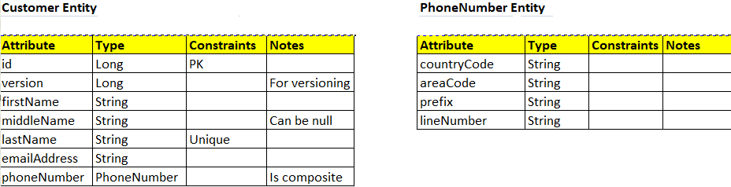
    </p>
* Create a Repository interface - **CustomerRepository** class extends JPARepository that will automatically implement basic CURD operations
* Create a Service class - **CustomerService** class that acts as a bridge between Controller and Repository class. It contains all the business logic
* Create a Controller class - **CustomerController** class it is responsible for handling incoming HTTP requests, processing them, and returning appropriate responses.
* Configure **application.yaml** file in a Spring Boot application for profiling, database connection settings, a connection pool, security configuration, Prometheus integration and Actuator
* Compile the application
  ```mvn
  mvn clean install
  ```
* Run the application
  ```mvn
  mvn spring-boot:run
  ```
* Once your application is up and running, you can access the following endpoints:
  - **GET /api/customers**: Retrieve all Customers
  - **GET /api/customers/{id}**: Retrieve an Customer by ID
  - **POST /api/customers**: Create a new Customer
  - **PUT /api/customers/{id}**: Update an existing Customer
  - **DELETE /api/customers/{id}**: Delete an Customer

### Feature that are implemented in this application
---
* Implemented **Versioning** concept to track changes made to Customer entity
* Used **@embedded** and **@embeddable** concept to make PhoneNumber as composite dataType
* Used **Mapper** - CustomerMapper interface for converting between different object types (CustomerRequest to Customer and Customer to CustomerResponse class)
* Used **RequestFilter** class to get PATH, ENV data and **RequestLoggingFilter** class to get PODNAME.
* Used **Spring Security** framework to implement HTTP Basic Authentication for all the CRUD Rest APIs
* Implemented **Slf4j logging** framework
* Implemented **GlobalExceptionHandling** concept using **@RestControllerAdvice**
* Taken care of proper response structure for success and error scenarios
* Used **Profiling** concept to separate configurations for different environments
* Implemented **Validation** using **@valid** annotation to validate the request body while creating or updating a customer
* Configured **Spring Boot Actuator** to gather insights into application's health, performance and overall metrics data
* Configured **Prometheus** for collecting, storing, and querying metrics from various services
* Visualizing metrics that Prometheus collect from Spring Boot application using **Grafana**

### This application has 4 environments - DEV, TEST, UAT3, PROD
---
- **Dev environment** is selected by default, when application is run **Locally**. This is for developing
- **TEST environment** is for Testing the application - Unit Testing and Integration Testing
- **UAT3 environment** is used when application is used as **Dockerized Application**
- **PROD environment** is used when application is used in **Minikube - Running in Kubernetes**
  
### Important things to note
---
* **H2 database** for **Testing the framework**
* **MYSQL** used for **DEV, UAT3 and PROD environment**
* **Prometheus and Grafana** is only setup in UAT3 envrionment
* Application is **secure** at all environment
* **AutoScaling** and **LoadBalancing** is taken care only in PROD environment

### Project Structure
---
<p align="center">
  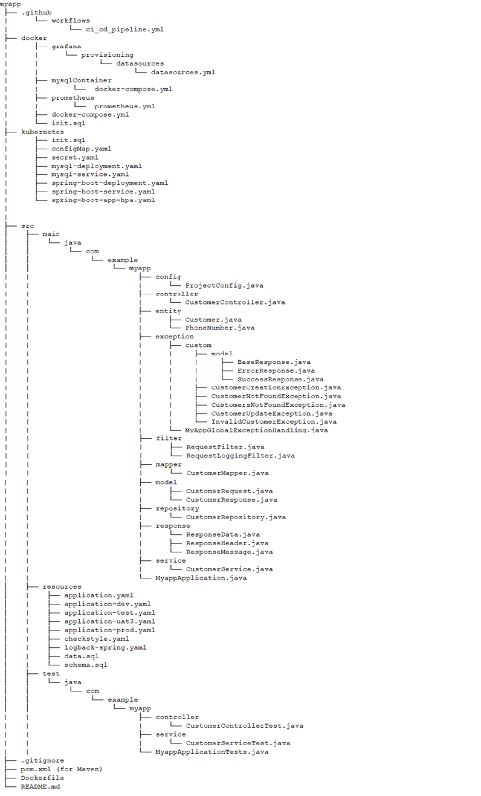
</p>

### Build the application without Running Tests
---
* Once code is ready, use the below command to clean the project, install the necessary dependencies, and package the application. The -DskipTests flag skips the test execution during the build process.
  ```
  mvn clean install -DskipTests
  ```
### Run the application Locally which is DEV environment
---
* Once the project is build, make sure to have the mysql container up and running in docker desktop that must be created as a part of Prerequisities step     [Need docker-compose file for creating mysql container named **library**](#Prerequisities-needed)
  <p align="center">
      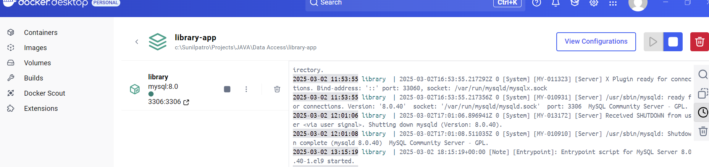
  </p>
* Run Spring boot application locally using the following Maven command. By default profile selected is **dev** environment
  ```
  mvn spring-boot:run 
  ```
* To run the application on different ports
  ```
  mvn spring-boot:run -Dspring-boot.run.arguments="--server.port=8081"
  ```
* Run the packaged **JAR** file instead of using mvn spring-boot:run
  ```
  java -jar target\myapp-1.0.jar
  ```
* Test the application
```
# Retrieve all Customers
curl.exe -u dev:devPassword --location http://127.0.0.1:8080/api/customers
```
<p align="center">
  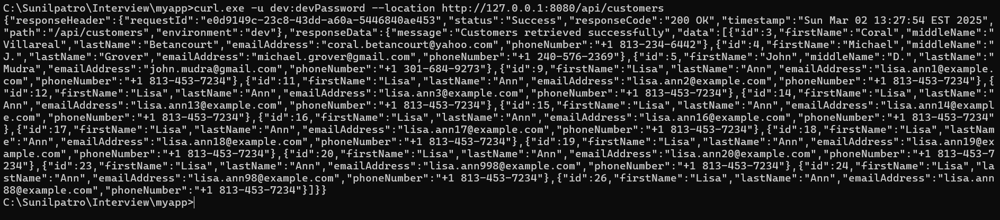
</p>

```
# Retrieve an Customer by ID
curl.exe -u dev:devPassword --location http://127.0.0.1:8080/api/customers/1
```
<p align="center">
  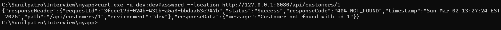
</p>
  
```
# Create a new Customer
curl.exe -u dev:devPassword -X POST -H "Content-Type: application/json" -d  "{\"firstName\":\"Lisa\", \"lastName\":\"Ann\", \"emailAddress\":\"lisa.ann298@example.com\", \"phoneNumber\":\"+1 813-453-7234\"}" --location http://127.0.0.1:8080/api/customers
```
<p align="center">
  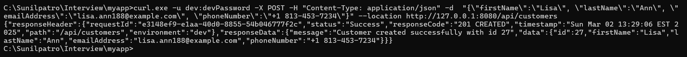
</p>
  
```
# Update an existing Customer
curl.exe -u dev:devPassword -X PUT -H "Content-Type: application/json" -d  "{ \"phoneNumber\":\"+1 813-453-1234\"}" --location    http://127.0.0.1:8080/api/customers/15
```
<p align="center">
  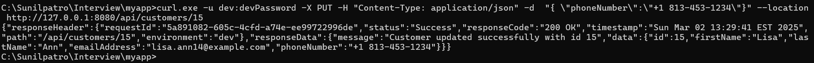
</p>
  
```
# Delete an Customer
curl.exe -u dev:devPassword -X DELETE --location http://127.0.0.1:8080/api/customers/19
```
<p align="center">
  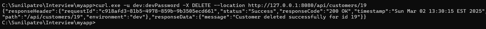
</p>

### Test the application with unit and integration testing -- TEST Environment
---
* Run the unit testing
  ```
  # To test CustomerController class
  mvn -Dtest=CustomerControllerTest test

  # To test CustomerService class
  mvn -Dtest=CustomerServiceTest test
  ```
* To Run specific method in specific class
  ```
  mvn -Dtest=CustomerControllerTest#testGetCustomerById test
  ```
* Run both unit and integration testing. For integration testing, we are using **Test** profile which is our **TEST** environment. It takes the username and password to authenticate from [application-test.yaml](myapp/src/main/resources/application-test.yaml)
  ```
  mvn test
  ```
### To automate the CI/CD pipeline for your Spring Boot application using GitHub Actions
---
* This GitHub Actions workflow automates the process of building and deploying a Spring Boot application.
Please refer to [ci_cd_pipeline.yml](.github/workflows/ci_cd_pipeline.yml)
* It includes:
  - Build
    - Setting up Java and Docker environments
    - Building the application with Maven
    - Running tests
    - Package it
    - Build the docker image
    - Push the docker image
  - Deploy
    - Setting up Java and Docker-Compose environments
    - Deploy the mysql Container using [docker_compose.yml](myapp/docker/mysqlContainer/docker-compose.yml)
    - Build 
    - Run the application
      > **Note**
      > This CRUD Spring Boot application will connect to external MYSQL database running in mysql Container in docker
    - Verify the health of the application
      
 ### Run the Spring Boot CRUD application in Dockerized Environment  -- UAT3 Environment
 ---
 * Stop the mysql container that is running in docker desktop as part of Prerequisities step [Need docker-compose file for creating mysql container named **library**](#Prerequisities-needed). Otherwise, there will be port conflict of 3306.
 * Stop the Spring Boot CRUD application which is running locally in port 8080. Otherwise, there will be a port conflict of 8080.
 * Now, start the Docker containers, networks, and volumes associated with a docker-compose project using [docker_compose.yml](myapp/docker/docker-compose.yml)
 ```
 docker-compose up
 ```
 * **docker** network gets created under which we have app-1, mysql-db, prometheus, grafana containers which are attached to each other
   <p align="center">
      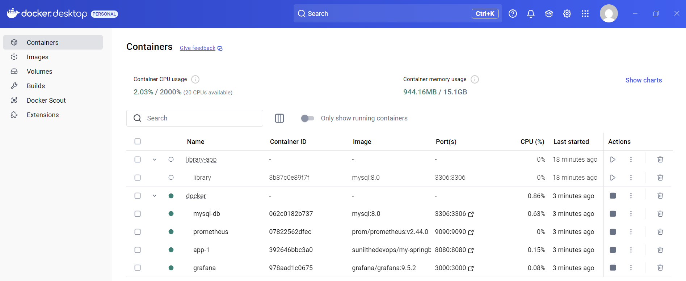
   </p>
 * Some basic commands that we can run -
   ```
   # To check Running Containers
   docker ps
   ```
   <p align="center">
      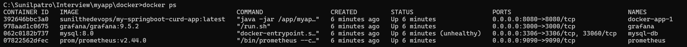
   </p>
   
   ```
   # View Container logs
   docker logs <container_name_or_id>
   ```
   <p align="center">
      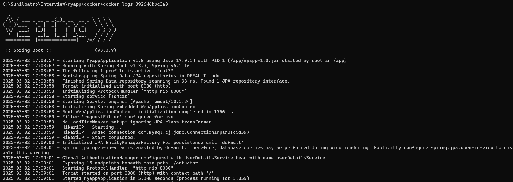
   </p>
   
   ```
   # To access the Container's shell
   docker exec -it <container_name_or_id> bash
   ```
   <p align="center">
      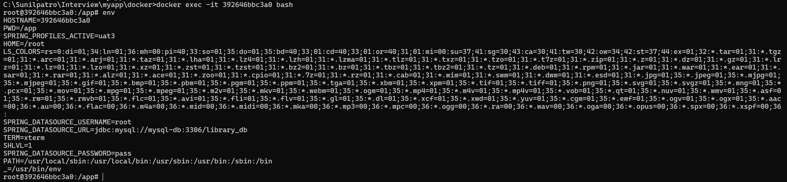
   </p>
   
 * To Test the application
   ```
   # Retrieve all Customers
   curl.exe -u uat3:uat3Password --location http://127.0.0.1:8080/api/customers
   ```
   <p align="center">
      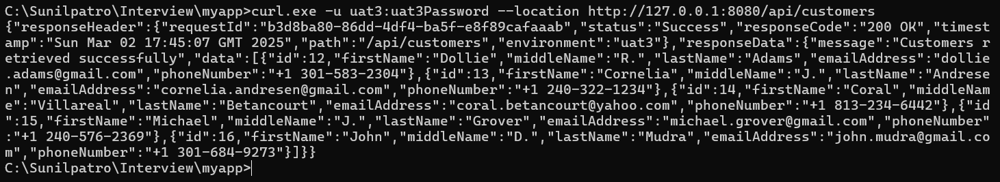
   </p>
   
   ```
   # Retrieve an Customer by ID
   curl.exe -u uat3:uat3Password --location http://127.0.0.1:8080/api/customers/16
   ```
   <p align="center">
      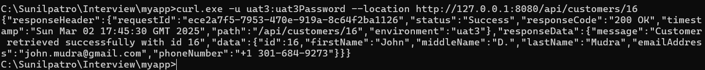
   </p>
      
   ```
   # Create a new Customer
   curl.exe -u uat3:uat3Password -X POST -H "Content-Type: application/json" -d  "{\"firstName\":\"Lisa\", \"lastName\":\"Ann\", \"emailAddress\":\"lisa.ann298@example.com\", \"phoneNumber\":\"+1 813-453-7234\"}" --location http://127.0.0.1:8080/api/customers
   ```
   <p align="center">
      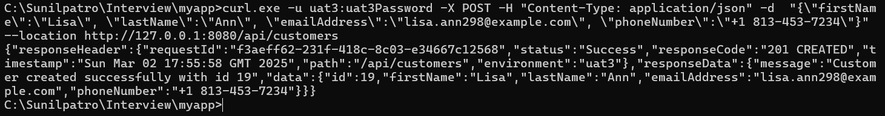
   </p>
      
   ```
   # Update an existing Customer
   curl.exe -u uat3:uat3Password -X PUT -H "Content-Type: application/json" -d  "{ \"phoneNumber\":\"+1 813-453-1234\"}" --location    http://127.0.0.1:8080/api/customers/15
   ```
   <p align="center">
      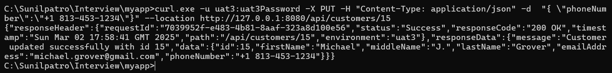
   </p>
      
   ```
   # Delete an Customer
   curl.exe -u uat3:uat3Password -X DELETE --location http://127.0.0.1:8080/api/customers/21
   ```
   <p align="center">
      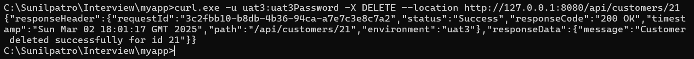
   </p>

 * To Stop and Remove Docker containers, networks, and volumes associated with a docker-compose project using [docker_compose.yml](myapp/docker/docker-compose.yml)
 ```
 docker-compose down -v
 ```
 ### For the Metrics Monitoring
 ---
 
 * Open the prometheus url
   ```
   http://localhost:9090/
   ```
 * Check the **process cpu usage**
   <p align="center">
      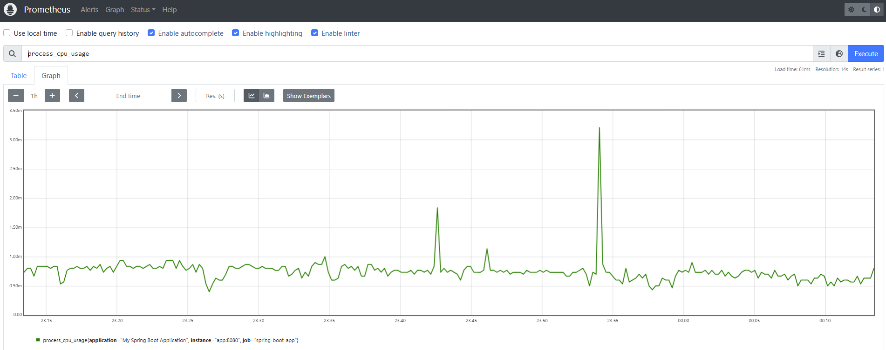
   </p>
 * Check the **http server requests active seconds count**
   <p align="center">
      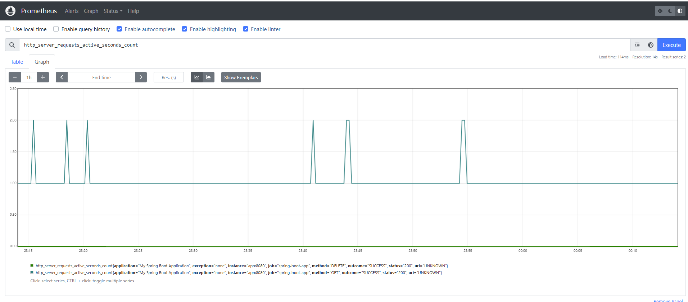
   </p>
 * Similarly, open the grafana url to visualize the prometheus data. For the first time it will ask for username:password give admin/admin and set the new password as admin.
   ```
   http://localhost:3000/
   ```
   <p align="center">
      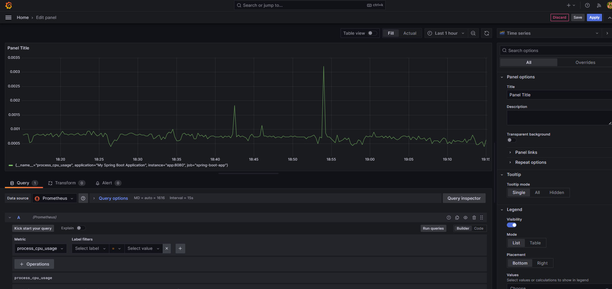
   </p>
 ### Run the Spring Boot CRUD application in Kubernetes cluster managed by Minikube  -- PROD Environment
 ---
 * To start Minikube using the Docker driver
 ```
 minikube start --driver=docker
 ```
   <p align="center">
      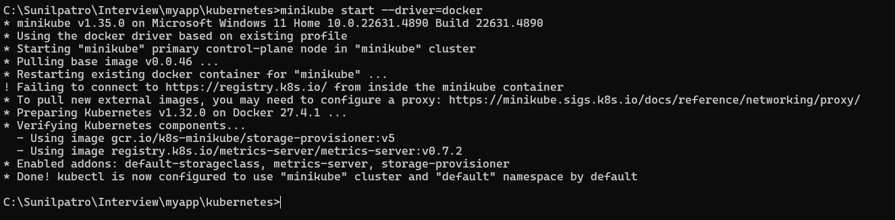
   </p>
   <p align="center">
      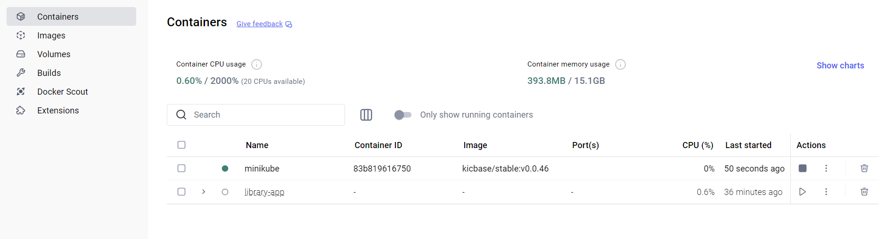
   </p>
   
 * To check the status of Minikube
 ```
 minikube status
 ```
   <p align="center">
      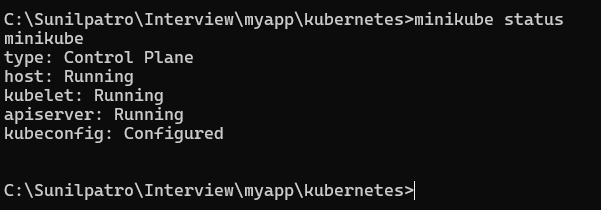
   </p>
   
 * To check that the Docker containers for the Kubernetes cluster are running
 ```
 docker ps
 ```

 * To verify docker configuration
 ```
 docker info
 ```

 * Create a configmap yaml file [See here](myapp/kubernetes/configMap.yaml). This ConfigMap stores the database URL and some other Spring Boot-related settings.
 * Apply the configmap
   ```
   kubectl apply -f configmap.yaml
   ```
 * Create a secret yaml file [See here](myapp/kubernetes/secret.yaml). The secret is storing sensitive information, such as db username and password.
 * Apply the secret
   ```
   kubectl apply -f secret.yaml
   ```
   
 * To start MySQL Container on Minikube using configmap.yaml and secret.yaml and expose it through a service
   - Use mysql-deployment.yaml [See here](myapp/kubernetes/mysql-deployment.yaml)
     ```
     kubectl apply -f mysql-deployment.yaml
     ```
   - Use mysql-service.yaml [See here](myapp/kubernetes/mysql-service.yaml)
     ```
     kubectl apply -f mysql-service.yaml
     ```
     
 * To start the Spring Boot CRUD application on Minikube using configmap.xml and secret.xml by fetching the image from docker hub
    - Use spring-boot-deployment.yaml [See here](myapp/kubernetes/spring-boot-deployment.yaml)
     ```
     kubectl apply -f spring-boot-deployment.yaml
     ```
   - Use spring-boot-service.yaml [See here](myapp/kubernetes/spring-boot-service.yaml)
     ```
     kubectl apply -f spring-boot-service.yaml
     ```
 * Copy a file from your local machine to a running mysql container in a Kubernetes pod
    ```
    kubectl cp init.sql mysql-deployment-5f88d6c7dd-wlscr:/init.sql    
    ```
   <p align="center">
      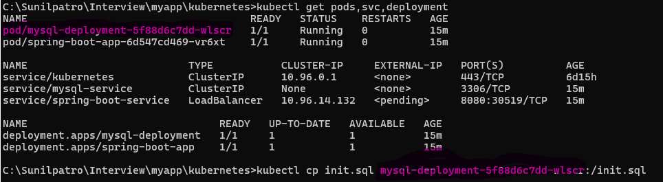
   </p>
   
 * To execute a MySQL initialization script inside a running MySQL container within a Kubernetes pod
   ```
   kubectl exec -it mysql-deployment-5f88d6c7dd-wlscr -- mysql -u root -p
   ```
   > **Note**
   > password will ask in prompt - give **pass**
   > and
   > refer the below screenshot how to execute the **init.sql**
   <p align="center">
      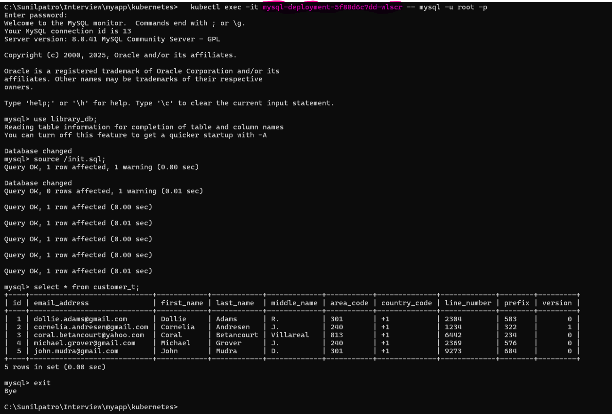
   </p>
   
 * To expose a Kubernetes service running in Minikube and retrieve the URL to access the service externally
   ```
   minikube service spring-boot-service --url
   ```
   > **Note**
   > this need to be run in one terminal and in other terminal you can do the curl request or hit the application from postman
   <p align="center">
      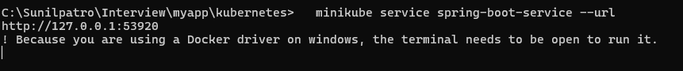
   </p>
   
 * Test the application
   > **Note**
   > the port number that we will be using will be the external port mentioned in the above screenshot
   
   ```
   # Retrieve all Customers
   curl.exe -u prod:prodPassword --location http://127.0.0.1:53920/api/customers
   ```
   <p align="center">
      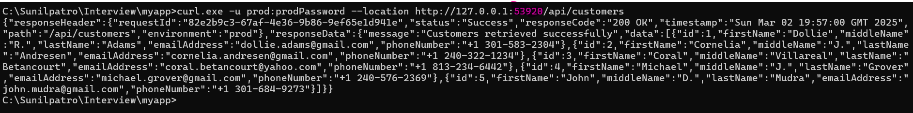
   </p>
   
   ```
   # Retrieve an Customer by ID
   curl.exe -u prod:prodPassword --location http://127.0.0.1:53920/api/customers/1
   ```
   <p align="center">
      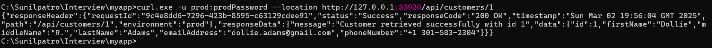
   </p>
      
   ```
   # Create a new Customer
   curl.exe -u prod:prodPassword -X POST -H "Content-Type: application/json" -d  "{\"firstName\":\"Lisa\", \"lastName\":\"Ann\", \"emailAddress\":\"lisa.ann298@example.com\", \"phoneNumber\":\"+1 813-453-7234\"}" --location http://127.0.0.1:53920/api/customers
   ```
   <p align="center">
      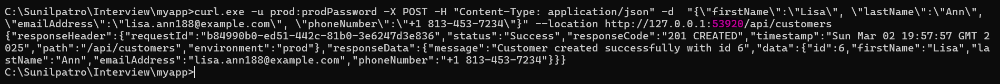
   </p>
      
   ```
   # Update an existing Customer
   curl.exe -u prod:prodPassword -X PUT -H "Content-Type: application/json" -d  "{ \"phoneNumber\":\"+1 813-453-1234\"}" --location    http://127.0.0.1:53920/api/customers/2
   ```
   <p align="center">
      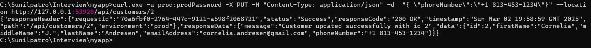
   </p>
      
   ```
   # Delete an Customer
   curl.exe -u prod:prodPassword -X DELETE --location http://127.0.0.1:53920/api/customers/6
   ```
   <p align="center">
      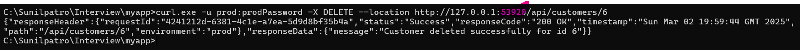
   </p>


   
##### Some basic commands of kubectl
     
 * To see the list of running pods
   ```
   kubectl get pods
   ```
   
 * To see the services running in Kubernetes
   ```
   kubectl get services
   ```
   
 * To see the deployments in your Kubernetes cluster
   ```
   kubectl get deployments
   ```
   
 * Check the logs of a specific pod
   ```
   kubectl logs <pod-name>
   ```
   
 * Check deployment events
   ```
   kubectl describe deployment <deployment-name>
   ```
   
 * To enter into any pods and run commands directly inside the container
   ```
   # Getting inside the container
   kubectl exec -it spring-boot-app-9f4c5bc9-v6jxx -- /bin/bash

   # Seeing the envrionment variable inside the container
   root@spring-boot-app-9f4c5bc9-v6jxx:/app# env
   ```

 * To list all configmap 
   ```
   kubectl get configmaps
   ```

 * To view a configmap 
   ```
   kubectl get configmap <configmap-name> -o yaml
   ```
   
 * To list all secrets
   ```
   kubectl get secrets
   ```

 * To view a secret
   ```
   kubectl get secret <secret-name> -o yaml
   ```

 * To delete the pods, service, deployment, hpa, configmap, secret
   ```
   # To delete the Horizontal Pod AutoScaler (hpa)
   kubectl apply -f spring-boot-app-hpa.yaml

   # To delete the deployment of spring-boot-app container
   kubectl delete deployment spring-boot-app

   # To delete the deployment of mysql container
   kubectl delete deployment mysql-deployment

   # To delete the service of spring-boot-app
   kubectl delete service spring-boot-service

   # To delete the service of mysql
   kubectl delete service mysql-service

   # To delete the config map
   kubectl delete configmap app-config

   # To delete the secret
   kubectl delete secret db-secret
   ```
 * To stop the minikube
   ```
   minikube stop
   ```

 ### To configure AutoScaling using Horizontal Pod AutoScaler (hpa)
 ---
 * Ensure metrics server is installed. As the Horizontal Pod Autoscaler relies on the Metrics Server to gather resource usage metrics (like CPU and memory) for 
   your pods
   ```
   kubectl get deployment metrics-server -n kube-system
   ```
   <p align="center">
      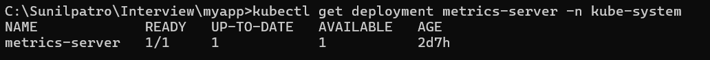
   </p>

 * If it's not installed, you can install it using the following commands:
   ```
   kubectl apply -f https://github.com/kubernetes-sigs/metrics-server/releases/latest/download/components.yaml
   ```
   
* Create a **Horizontal Pod Autoscaler** deployment file [See here](myapp/kubernetes/spring-boot-app-hpa.yaml)
* Apply the hpa file
  ```
  kubectl apply -f spring-boot-app-hpa.yaml
  ```
  
* Once HPA is created, and you can see the status of it
  ```
  kubectl get hpa
  ```
 ### For Configuring the LoadBalacing
 * Make sure in the spring-boot-service.yaml file you need to use the **type as LoadBalancer**, which means it this application will provision an external load       balancer [Check the file](myapp/kubernetes/spring-boot-service.yaml)

 
 ### Test the Autoscaler
 * To get the list of pods, services, deployment and hpa
 ```
 kubectl get pods,svc,deployment,hpa
 ```
 <p align="center">
   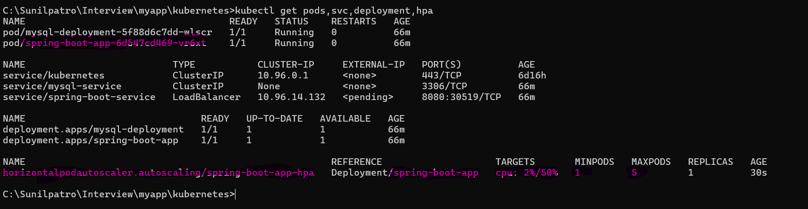
 </p>

 * Run the powershell and hit the getCustomers api in infinite loop
 <p align="center">
   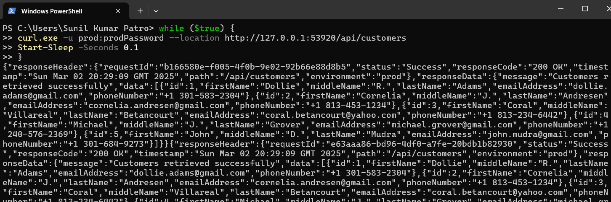
 </p> 

 * After sometime, check the hpa status. We will see the cpu usage got increased. We have configured in hpa yaml file that if it increase by 50% then autoscale       the springboot application pod. And thats what we are seeing in the below screenshot
 ```
 kubectl get pods,svc,deployment,hpa
 ```
  <p align="center">
   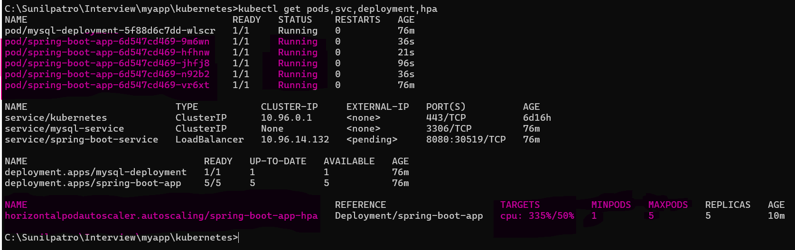
 </p> 

 
 ### Test the LoadBalancing
 * Check the logs of all the pods of spring-boot-app. You will see the request are getting distributed between different pods
 ```
 # To see the logs of all the spring-boot-app pods
 kubectl logs spring-boot-app-6d547cd469-9m6wn
 kubectl logs spring-boot-app-6d547cd469-hfhnw
 kubectl logs spring-boot-app-6d547cd469-jhfj8
 kubectl logs spring-boot-app-6d547cd469-n92b2
 kubectl logs spring-boot-app-6d547cd469-vr6xt
 ```
 ### Created a Testing Framework Application, a command-line based that consumes the SpringBoot CRUD application
 ---
 
 * Make sure to have the mysql container up and running in docker desktop that must be created as a part of Prerequisities step     [Need docker-compose file for creating mysql container named **library**](#Prerequisities-needed)
  <p align="center">
      
  </p>
  
* Run Spring boot application locally using the following Maven command at **port 8080**. By default profile selected is **dev** environment
  ```
  mvn spring-boot:run 
  ```
  
* Once it is confirmed, Spring Boot CRUD application is up and running
* Then, run the testingFmk CLI application at **port 8082**
* Once it start, it was show a switch-case structure in your command-line application that consumes the REST API endpoints of a CRUD Spring Boot application. Like shown in below screenshot.
<p align="center">
   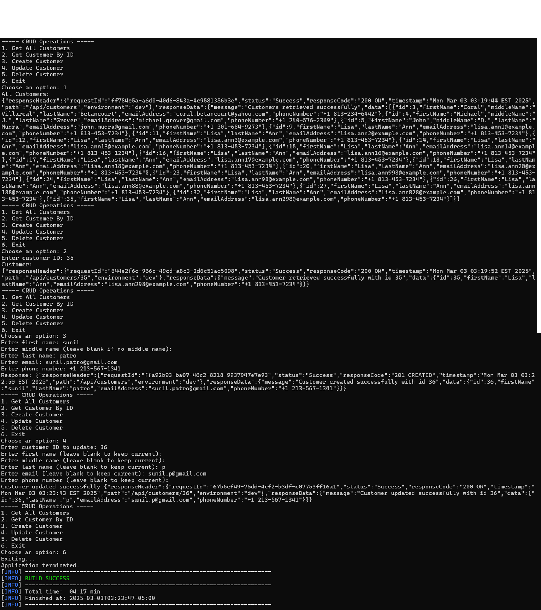
 </p> 

 

